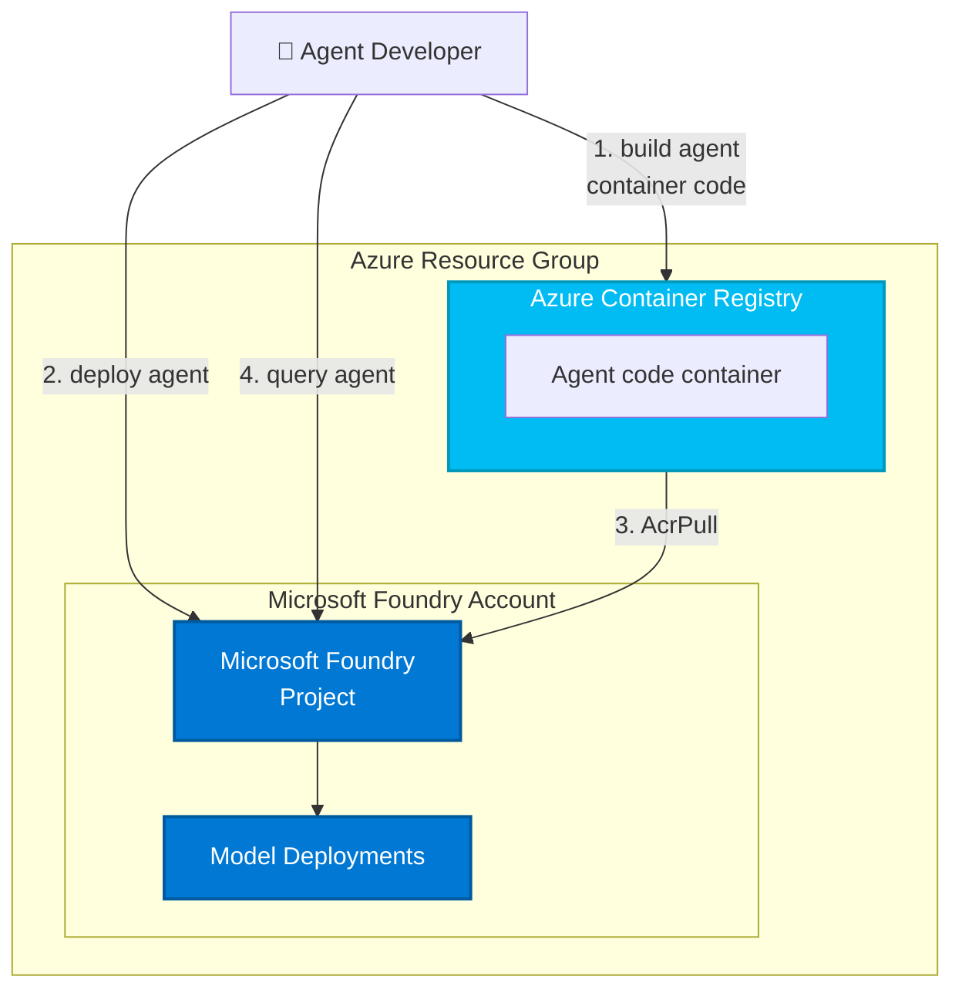

# Microsoft Foundry - Hosted Agents Deployment Template

This Azure Developer CLI (azd) template provides a **complete solution for deploying Hosted Agents** to Microsoft Foundry (formerly Azure AI Foundry). Hosted Agents are fully managed, containerized AI agents that run directly in Microsoft Foundry, eliminating the need to manage your own infrastructure.

## What's Included

This template includes everything you need to deploy Hosted Agents to Microsoft Foundry:
- ✅ **Complete Infrastructure**: Microsoft Foundry workspace, Container Registry, model deployments, and Agent Service hosting
- ✅ **5 Ready-to-Deploy Hosted Agents**: Calculator, Web Search, Microsoft Docs, RAG with text search, and MCP-enabled agents
- ✅ **One-Command Deployment**: Deploy all hosted agents with a single `azd deploy` command
- ✅ **Fully Managed Hosting**: Auto-scaling, monitoring, and container orchestration handled by Microsoft Foundry

**Perfect for:** Developers who want to deploy production-ready AI agents without managing containers, servers, or Kubernetes infrastructure.

[Features](#features) • [Getting Started](#getting-started) • [Deployment Guide](#deployment-guide) • [Guidance](#guidance)

---

**⚠️ Important Notice**: This template is designed for learning, demonstration, and development purposes. For production deployments, implement additional security measures following [Microsoft Foundry security best practices](https://learn.microsoft.com/azure/ai-foundry/).

**Your Responsibility**: When deploying AI solutions, you are responsible for assessing risks and complying with all applicable laws and safety standards. Learn more: [Agent Service Transparency](https://learn.microsoft.com/azure/ai-foundry/responsible-ai/agents/transparency-note) | [Agent Framework FAQ](https://github.com/microsoft/agent-framework/blob/main/TRANSPARENCY_FAQ.md)

## Features

This template provides a complete solution for deploying **Hosted Agents** in Microsoft Foundry:

### What are Hosted Agents?
Hosted Agents are containerized AI agents that run as fully managed services in Microsoft Foundry. You provide the agent code and configuration, and Microsoft Foundry handles:
- Container building and registry management
- Deployment and scaling infrastructure
- Model integration and API endpoints
- Monitoring and logging

### Included Hosted Agents
* **Calculator Agent**: Performs arithmetic calculations using LangGraph framework
* **Web Search Agent**: Searches the web using Bing grounding for real-time information
* **Microsoft Docs Agent**: Searches Microsoft Learn documentation using Model Context Protocol (MCP)
* **Text Search RAG Agent**: Uses retrieval augmented generation with custom knowledge bases
* **Hosted MCP Agent**: Demonstrates advanced Model Context Protocol integration with hosted servers

### Infrastructure Components
* **Microsoft Foundry Project**: Complete workspace and Agent Service hosting environment
* **Model Deployments**: Automatic deployment of GPT-4o-mini models with optimized configurations
* **Azure Container Registry**: Secure container image storage for agent containers
* **Managed Identity**: Built-in Azure Managed Identity for secure, keyless authentication
* **Auto-scaling**: Configured replica scaling (min/max) for optimal performance and cost
* **Agent Service Hosting**: Fully managed container orchestration and API endpoints

### Architecture Diagram

This template provisions the complete infrastructure required for Hosted Agents in Microsoft Foundry:

| Resource | Description |
|----------|-------------|
| [Microsoft Foundry](https://learn.microsoft.com/azure/ai-foundry) | Provides a collaborative workspace for AI development with access to models, data, and compute resources |
| [Azure Container Registry](https://learn.microsoft.com/azure/container-registry/) | Stores and manages container images for secure deployment |
| [Application Insights](https://learn.microsoft.com/azure/azure-monitor/app/app-insights-overview) | *Optional* - Provides application performance monitoring, logging, and telemetry for debugging and optimization |
| [Log Analytics Workspace](https://learn.microsoft.com/azure/azure-monitor/logs/log-analytics-workspace-overview) | *Optional* - Collects and analyzes telemetry data for monitoring and troubleshooting |

Those resources will be used by the [`azd ai agent` extension](https://aka.ms/azdaiagent/docs) when building and deploying agents:



The template is parametrized so that it can be configured with additional resources depending on the agent requirements:

* deploy AI models by setting `AI_PROJECT_DEPLOYMENTS` with a list of model deployment configs,
* provision additional resources (Azure AI Search, Bing Search) by setting `AI_PROJECT_DEPENDENT_RESOURCES`,
* enable monitoring by setting `ENABLE_MONITORING=true` (default on),
* provision connections by setting `AI_PROJECT_CONNECTIONS` with a list of connection configs.

## Prerequisites

* Install [azd](https://aka.ms/install-azd)
  * Windows: `winget install microsoft.azd`
  * Linux: `curl -fsSL https://aka.ms/install-azd.sh | bash`
  * MacOS: `brew tap azure/azd && brew install azd`

## Deployment Guide

Choose the scenario that matches your needs:

1. **[Deploy with New Resources](#option-1-deploy-with-new-resources)** - Start from scratch and create all Azure resources automatically
2. **[Deploy with Existing Resources](#option-2-deploy-with-existing-resources)** - Use your existing Microsoft Foundry project and infrastructure

### Option 1: Deploy with New Resources

Use this option if you're starting fresh. This will automatically create a new Microsoft Foundry project, container registry, and all supporting infrastructure.

**Quick Command Reference:**
```bash
azd init --template Azure-Samples/ai-foundry-starter-basic
azd auth login
azd up
azd ai agent init -m https://github.com/azure-ai-foundry/foundry-samples/blob/main/samples/python/hosted-agents/calculator-agent/agent.yaml
azd deploy
```

Find more agent samples in the [foundry-samples repository](https://github.com/azure-ai-foundry/foundry-samples/tree/main/samples/python/hosted-agents).

**Detailed Steps:**

#### Step 1: Initialize Your Project

1. **Open your terminal** (PowerShell on Windows, Terminal on Mac/Linux)

2. **Navigate to where you want to create your project**

3. **Initialize the Azure Developer CLI template:**
   ```bash
   azd init --template Azure-Samples/ai-foundry-starter-basic
   ```
   
4. **Answer the prompts:**
   - **Environment name**: Enter a unique name (e.g., `my-agents-dev`)
   - This creates a local folder containing all infrastructure configuration

#### Step 2: Sign in to Azure

```bash
azd auth login
```

Your browser will open for authentication. Sign in with your Azure account.

#### Step 3: Create Azure Resources

This step creates all necessary Azure resources in your subscription:

```bash
azd up
```

**What happens during this command:**
- Creates a new resource group in your Azure subscription
- Provisions Microsoft Foundry workspace and project
- Creates Azure Container Registry for storing agent containers
- Sets up Application Insights for monitoring (optional)
- Configures networking, permissions, and managed identities

**Important:** This process takes approximately 10-15 minutes to complete.

**You'll be prompted for:**
- **Azure subscription**: Select the subscription where resources will be created
- **Azure region**: Choose a region (e.g., `eastus`, `westus2`, `northcentralus`)
  - Tip: Choose a region that supports the models you plan to use

#### Step 4: Initialize Your First Agent

Now that your infrastructure is ready, you can add an agent from the sample repository.

**Example - Adding the Calculator Agent:**

```bash
azd ai agent init -m https://github.com/azure-ai-foundry/foundry-samples/blob/main/samples/python/hosted-agents/calculator-agent/agent.yaml
```

**You'll be prompted to configure:**
- **Model SKU**: Select `GlobalStandard` (recommended for production)
- **Model deployment name**: Enter `gpt-4o-mini` or accept the default
- **Container memory**: Enter `2Gi` (2 gigabytes - suitable for most agents)
- **Container CPU**: Enter `1` (one CPU core)
- **Minimum replicas**: Enter `1` (always keep one instance running)
- **Maximum replicas**: Enter `3` (scale up to 3 instances under load)

#### Step 5: Deploy the Agent

```bash
azd deploy
```

This command will:
1. Build the agent container
2. Push it to Azure Container Registry
3. Deploy it to Microsoft Foundry
4. Configure environment variables and model deployments

**Success!** You'll see output with:
- Agent playground URL (test your agent in the browser)
- Agent endpoint URL (for API calls)

### Option 2: Deploy with Existing Resources

Use this option if you already have a Microsoft Foundry project and want to deploy agents to it without creating new infrastructure.

**Quick Command Reference:**
```bash
# Navigate to the hosted_agents project directory
azd auth login
azd env set AZURE_RESOURCE_GROUP <your-rg-name>
azd env set AZURE_SUBSCRIPTION_ID <your-sub-id>
azd env set AZURE_AI_PROJECT_NAME <your-project-name>
azd ai agent init -m https://github.com/azure-ai-foundry/foundry-samples/blob/main/samples/python/hosted-agents/calculator-agent/agent.yaml
azd deploy
```

**Detailed Steps:**

#### Step 1: Navigate to Project Directory

You already have the `hosted_agents` project, so you'll work directly in this directory.

1. **Open your terminal and navigate to the `hosted_agents` project directory**

2. **Verify you're in the correct location:**
   ```bash
   ls azure.yaml
   ```
   You should see:
   - `azure.yaml` - Main configuration file
   - `src/` - Directory containing all your agents
   - `infra/` - Infrastructure as code (Bicep templates)

#### Step 2: Sign in to Azure

```bash
azd auth login
```

#### Step 3: Connect to Your Existing Resources

Tell `azd` which Azure resources to use by setting environment variables:

```bash
azd env set AZURE_RESOURCE_GROUP <your-resource-group-name>
azd env set AZURE_SUBSCRIPTION_ID <your-subscription-id>
azd env set AZURE_AI_PROJECT_NAME <your-foundry-project-name>
```

**How to find these values:**
1. Open the [Azure Portal](https://portal.azure.com)
2. Navigate to your Microsoft Foundry project
3. On the Overview page, find:
   - **Resource group**: Copy this value (e.g., `rg-my-foundry`)
   - **Subscription ID**: Copy this GUID (e.g., `12345678-1234-1234-1234-123456789abc`)
   - **Project name**: Copy your project name (shown at the top)

#### Step 4: Add Agents to Your Project

For each agent you want to deploy, run the init command:

**Example - Calculator Agent:**

```bash
azd ai agent init -m https://github.com/azure-ai-foundry/foundry-samples/blob/main/samples/python/hosted-agents/calculator-agent/agent.yaml
```

**Example - Web Search Agent:**

```bash
azd ai agent init -m https://github.com/azure-ai-foundry/foundry-samples/blob/main/samples/python/hosted-agents/web-search-agent/agent.yaml
```

**Example - Microsoft Docs Agent:**

```bash
azd ai agent init -m https://github.com/azure-ai-foundry/foundry-samples/blob/main/samples/python/hosted-agents/msft-docs-agent/agent.yaml
```

**When prompted:**
- If a model deployment already exists in your project, you can select it from the list
- If creating a new model deployment, provide the required configuration
- Specify container resources (memory, CPU, and replica counts)

#### Step 5: Deploy All Agents

Deploy all configured agents at once:

```bash
azd deploy
```

Or deploy a specific agent:

```bash
azd deploy <agent-service-name>
```

**Example:**
```bash
azd deploy CalculatorAgentLG
```

### Adding Multiple Agents

You can deploy as many agents as you need to the same Microsoft Foundry project. Here are two approaches:

#### Method 1: Use Pre-built Agent Samples (Recommended)

The easiest way is to initialize agents from the samples repository. Simply run:

```bash
azd ai agent init -m https://github.com/azure-ai-foundry/foundry-samples/blob/main/samples/python/hosted-agents/agent_with_text_search_rag/agent.yaml
```

**Then deploy all agents:**

```bash
azd deploy
```

This command deploys all agents configured in your project.

#### Method 2: Deploy Your Own Custom Agent

If you've built your own agent, follow these steps:

1. **Create a directory for your agent under `src/`:**
   ```bash
   mkdir src/my-custom-agent
   cd src/my-custom-agent
   ```

2. **Add your agent files to this directory:**
   - `agent.yaml` - Agent configuration and metadata
   - `main.py` - Your agent's Python code
   - `Dockerfile` - Container image definition
   - `requirements.txt` - Python package dependencies

3. **Return to the `hosted_agents` project root and deploy:**
   ```bash
   cd ../..
   azd deploy
   ```
   
   The tool will automatically detect and deploy your custom agent from the `src/` directory.

### Available Agent Samples

Here are some ready-to-deploy agent samples from the foundry-samples repository:

| Agent | Description | Manifest URL |
|-------|-------------|--------------|
| **Calculator Agent** | Performs arithmetic calculations | `https://github.com/azure-ai-foundry/foundry-samples/blob/main/samples/python/hosted-agents/calculator-agent/agent.yaml` |
| **Web Search Agent** | Searches the web using Bing grounding | `https://github.com/azure-ai-foundry/foundry-samples/blob/main/samples/python/hosted-agents/web-search-agent/agent.yaml` |
| **Microsoft Docs Agent** | Searches Microsoft Learn documentation using MCP | `https://github.com/azure-ai-foundry/foundry-samples/blob/main/samples/python/hosted-agents/msft-docs-agent/agent.yaml` |
| **Text Search RAG Agent** | Uses retrieval augmented generation with search | `https://github.com/azure-ai-foundry/foundry-samples/blob/main/samples/python/hosted-agents/agent_with_text_search_rag/agent.yaml` |
| **Hosted MCP Agent** | Uses Model Context Protocol servers | `https://github.com/azure-ai-foundry/foundry-samples/blob/main/samples/python/hosted-agents/agent_with_hosted_mcp/agent.yaml` |
| **Agents in Workflow** | Orchestrates multiple agents in a workflow | `https://github.com/azure-ai-foundry/foundry-samples/blob/main/samples/python/hosted-agents/agents_in_workflow/agent.yaml` |

### Testing Your Deployed Agents

Once deployment completes successfully, you can test your agents using either method:

#### 1. Using the Agent Playground (Web Interface)

The easiest way to test your agent:

1. Copy the **Agent playground URL** from the deployment output
2. Open the URL in your web browser
3. Start a conversation with your agent
4. Observe agent responses, tool calls, and execution traces in real-time

#### 2. Using the API Endpoint (Programmatic)

Use the **Agent endpoint** URL with your preferred HTTP client:

```python
import requests

endpoint = "https://your-agent-endpoint-url"
headers = {
    "Content-Type": "application/json",
    "api-key": "your-api-key"
}

payload = {
    "messages": [
        {"role": "user", "content": "What is 25 * 4?"}
    ]
}

response = requests.post(endpoint, json=payload, headers=headers)
print(response.json())
```

### Troubleshooting Common Issues

#### Issue: "Model not available in selected region"

**Solution:** Check [model region availability](https://learn.microsoft.com/azure/ai-foundry/agents/concepts/model-region-support) and choose a supported region during `azd up`.

#### Issue: "Agent container failed to start"

**Solution:** 
1. Check container logs in Azure Portal
2. Verify your `Dockerfile` and `requirements.txt` are correct
3. Ensure sufficient memory/CPU resources are allocated

#### Issue: "Resource group not found"

**Solution:** When using existing resources, verify:
```bash
azd env get-values
```
Check that `AZURE_RESOURCE_GROUP` and other values are set correctly.

#### Issue: "Deployment timeout"

**Solution:** Container builds can take time. Wait for the process to complete (typically 5-15 minutes).

### Viewing Deployed Agents

To see all your deployed agents:

1. Go to [Microsoft Foundry portal](https://ai.azure.com)
2. Navigate to your project
3. Click **Agents** in the left menu
4. View all deployed agent versions and their endpoints

## Guidance

### Region Availability

This template does not use specific models. The model deployments are a parameter of the template. Each model may not be available in all Azure regions. Check for [up-to-date region availability of Microsoft Foundry](https://learn.microsoft.com/en-us/azure/ai-foundry/reference/region-support) and in particular the [Agent Service](https://learn.microsoft.com/en-us/azure/ai-foundry/agents/concepts/model-region-support?tabs=global-standard).

## Resource Clean-up

To prevent incurring unnecessary charges, it's important to clean up your Azure resources after completing your work with the application.

- **When to Clean Up:**
  - After you have finished testing or demonstrating the application.
  - If the application is no longer needed or you have transitioned to a different project or environment.
  - When you have completed development and are ready to decommission the application.

- **Deleting Resources:**
  To delete all associated resources and shut down the application, execute the following command:
  
    ```bash
    azd down
    ```

    Please note that this process may take up to 20 minutes to complete.

⚠️ Alternatively, you can delete the resource group directly from the Azure Portal to clean up resources.

### Costs

Pricing varies per region and usage, so it isn't possible to predict exact costs for your usage.
The majority of the Azure resources used in this infrastructure are on usage-based pricing tiers.

You can try the [Azure pricing calculator](https://azure.microsoft.com/pricing/calculator) for the resources deployed in this template.

* **Microsoft Foundry**: Standard tier. [Pricing](https://azure.microsoft.com/pricing/details/ai-foundry/)
* **Azure AI Services**: S0 tier, defaults to gpt-4o-mini. Pricing is based on token count. [Pricing](https://azure.microsoft.com/pricing/details/cognitive-services/)
* **Azure Container Registry**: Basic SKU. Price is per day and on storage. [Pricing](https://azure.microsoft.com/en-us/pricing/details/container-registry/)
* **Azure Storage Account**: Standard tier, LRS. Pricing is based on storage and operations. [Pricing](https://azure.microsoft.com/pricing/details/storage/blobs/)
* **Log analytics**: Pay-as-you-go tier. Costs based on data ingested. [Pricing](https://azure.microsoft.com/pricing/details/monitor/)
* **Azure AI Search**: Basic tier, LRS. Price is per day and based on transactions. [Pricing](https://azure.microsoft.com/en-us/pricing/details/search/)
* **Grounding with Bing Search**: G1 tier. Costs based on transactions. [Pricing](https://www.microsoft.com/en-us/bing/apis/grounding-pricing)

⚠️ To avoid unnecessary costs, remember to take down your app if it's no longer in use, either by deleting the resource group in the Portal or running `azd down`.

### Security guidelines

This template also uses [Managed Identity](https://learn.microsoft.com/entra/identity/managed-identities-azure-resources/overview) for local development and deployment.

To ensure continued best practices in your own repository, we recommend that anyone creating solutions based on our templates ensure that the [Github secret scanning](https://docs.github.com/code-security/secret-scanning/about-secret-scanning) setting is enabled.

You may want to consider additional security measures, such as:

- Enabling Microsoft Defender for Cloud to [secure your Azure resources](https://learn.microsoft.com/azure/defender-for-cloud/).
- Protecting the Azure Container Apps instance with a [firewall](https://learn.microsoft.com/azure/container-apps/waf-app-gateway) and/or [Virtual Network](https://learn.microsoft.com/azure/container-apps/networking?tabs=workload-profiles-env%2Cazure-cli).

> **Important Security Notice** <br/>
This template, the application code and configuration it contains, has been built to showcase Microsoft Azure specific services and tools. We strongly advise our customers not to make this code part of their production environments without implementing or enabling additional security features.  <br/><br/>
For a more comprehensive list of best practices and security recommendations for Intelligent Applications, [visit our official documentation](https://learn.microsoft.com/en-us/azure/ai-foundry/).
